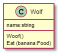

# Class Diagram
## Class Block
Format:
```
ClassName
---
Attributes
---
Methods
```
Attribute Format:<br/>
name : attribute type = default value<br/>
- name: string
- age: int = 18
Method Format:<br/>
name(parameter list) : type of value returned<br/>
- Howl()
- Eat(food:string, amt:int):bool


## Class Relationships
### Inheritance
A solid line from child class to parent class with unfilled arrowhead.<br/>
